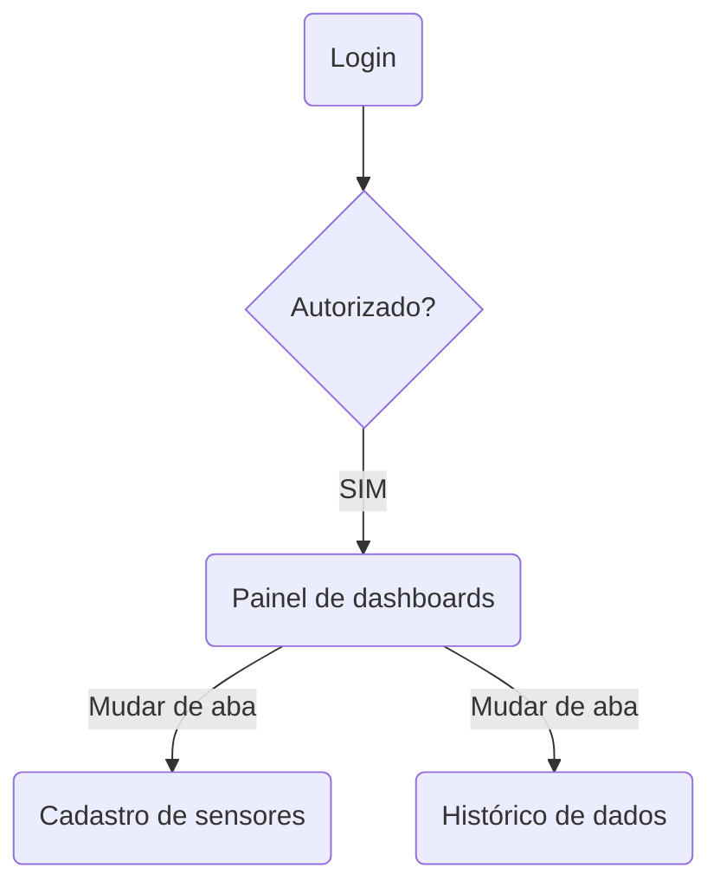
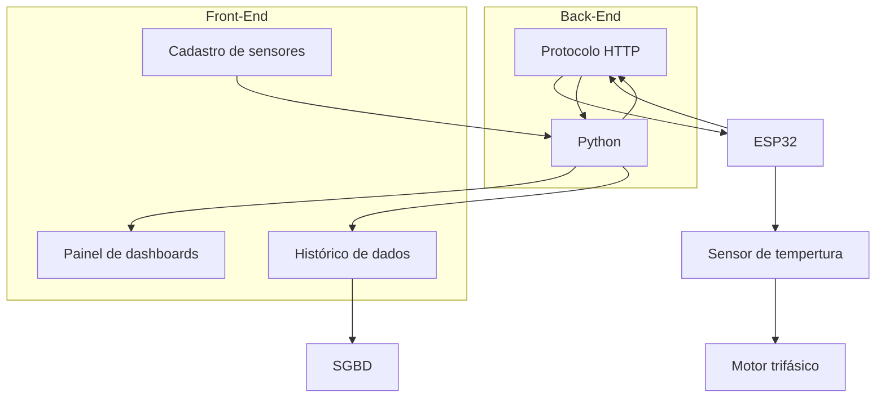

# PRD - Product Requirements Document

# *Introdução & objetivo*

O controle de temperatura em bombas industriais é um aspecto crítico para garantir o bom funcionamento, a segurança e a durabilidade do equipamento. Em muitas indústrias, as bombas são utilizadas para a movimentação de fluidos em sistemas essenciais, como processos de resfriamento, aquecimento ou pressurização. A falha na operação de uma bomba, devido ao superaquecimento, pode causar paradas inesperadas na produção, danos permanentes ao equipamento e até mesmo riscos de acidentes. Esse sistema será integrado a sensores instalados no motor, e as informações serão enviadas via HTTP para o back-end e armazenadas em um banco de dados. Em caso de sobreaquecimento, um alerta será enviado ao supervisor.

# *Por que* implementar isto?

“A manutenção preditiva, baseada em dados de monitoramento contínuo, pode reduzir os custos com reparos e aumentar a vida útil dos equipamentos, melhorando a eficiência operacional.” -  General Electric (GE)

Ou seja, como explicitado previamente, sistemas de monitoramento avançados não apenas detectam falhas, mas também otimizam a operação de máquinas, ajustando parâmetros conforme a interpretação do operador. A visualização personalizada dos dados e condições do equipamento, assim, auxiliam a prevenção a falhas e defeitos eficientemente de acordo com o histórico dos insights levantados pela interface através de uma determinada amostragem de tempo. Portanto, a atualização em tempo real das referências materiais e físicas é fundamental para a performance plena do motor em condições rígidas da linha de produção.

Manutenção inteligente: **reduz** custos, **previne** falhas e **maximiza** a performance operacional. 

# ***Público alvo***

Visto a necessidade do monitoramento dos dados do motor para garantir o correto funcionamento do sistema de produção, faz-se preciso a liberação de tais dados ao pessoal qualificado da administração e controle da produção, mantendo, dessa forma, um controle mais firme e seguro quando, por exemplo, ocorrerem falhas devido ao sobreaquecimento dos motores. É válido também ressaltar que torna-se possível até mesmo prever quando falhas hão de ocorrer, possibilitando manutenções preditivas.

| **Perfil de usuário** | **Descrição, necessidades e interesses.** |
| --- | --- |
| Supervisor de produção | Responsável por policiar a execução plena da linha de produção, deverá, através do sistema, verificar o estado de funcionamento do motor via visualização do monitoramento de sua temperatura, podendo acionar uma manutenção quando necessário. |
| Equipe de manutenção | Deve também ter acesso aos dados de temperatura do motor em um intervalo maior de tempo para avaliar sua condição de forma mais precisa, definindo os métodos a serem tomados. |

# *Personas*

1. **João Pires:** Supervisor de manutenção, responsável por garantir o funcionamento contínuo da linha de produção e por gerenciar projetos de automação e melhorias nas máquinas e equipamentos.
2. **Ana Clara:** Eletricista de manutenção, responsável pela manutenção preventiva e preditiva das máquinas, além de verificar a limpeza das máquinas e dos painéis elétricos.
3. **Renata Almeida:** Eletricista de manutenção, responsável pela manutenção corretiva, com o objetivo de minimizar as paradas das máquinas, e também encarregado de emitir e gerenciar as Ordens de Serviço.

---

# *Requisitos Funcionais*

1. **Medição de Temperatura em Tempo Real:** O sistema deve medir continuamente a temperatura da bomba, utilizando sensores adequados. **P1**
3. **Alarmes e Notificação Automática:** O sistema deve emitir alertas automaticamente se a temperatura ou vibração ultrapassarem limites pré-definidos, enviando notificações via SMS, e-mail ou push. **P2**
4. **Armazenamento e Histórico de Dados** Os dados de temperatura e vibração devem ser armazenados para análise histórica e geração de relatórios. **P1**
3. **Visualização de Dados em Dashboards:** O sistema deve fornecer uma interface para visualização em tempo real dos dados coletados, apresentando gráficos e dashboards fáceis de interpretar. **P1**

**P1** = **Crítico | P2 = Importante | P3 = Bom ter**

### *Casos de uso e/ou User story*

> **Caso de uso 1:** Como um supervisor de produção, quero ter acesso à informações críticas de elementos cruciais da produção para evitar possíveis falhas no sistema.
> 

> **Caso de uso 2:** Como um membro da equipe de manutenção, quero verificar dados relacionados aos elementos da linha de produção ao longo do tempo para avaliar quando a manutenção será realizada.
> 

---

# *Requisitos Não Funcionais*

1. **Desempenho:** O sistema deve manter o gráfico de temperatura atualizado em tempo real. **P2**
2. **Acurácia dos dados:** Garantir que os dados estejam corretos e precisos para a posterior análise e modelagem. **P1**
3. **Sensores:** Assegurar que os dispositivos de entrada dos dados estejam em bom funcionamento para, consequentemente, gerar insights nas análises. **P1**
4. **Acessibilidade do sistema:** Apesar da necessidade da usabilidade nas mais diversas condições físicas e psicológicas, devem ser contadas previamente para o desenvolvimento de funcionalidades individuais de cada usuário. **P3**
5. **Compatibilidade do sistema:** O sistema deve ser compatível com os principais navegadores para garantir o acesso ao monitoramento. **P2**

**P1** = **Crítico | P2 = Importante | P3 = Bom ter**

# Diagrama de atividade

# Diagrama de Contexto

